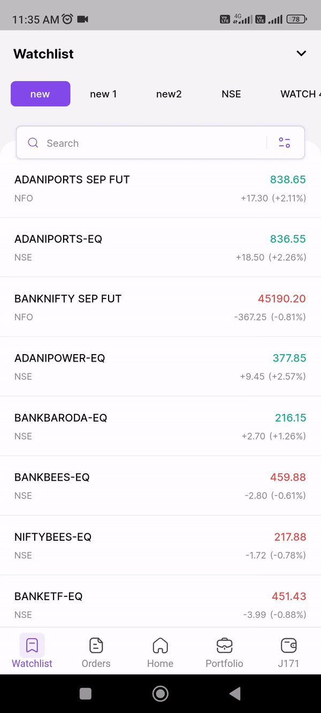
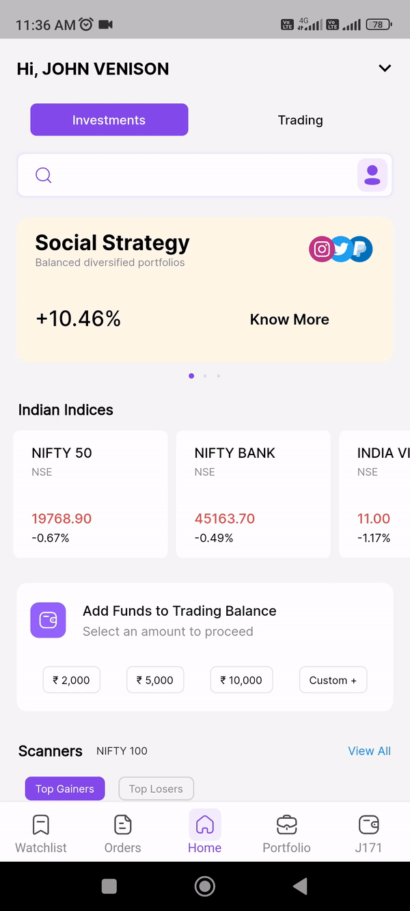

---

title: Trade settings

---

# Trade settings

The trade settings are a powerful tool that can help you to create a trading app that is both visually appealing and functional. By taking the time to customize the settings, you can create an app that is tailored to your individual needs and preferences.

## How to enable fixed headers

* Go to “Home Page”
* Click “Profile icon” to open your account page
* Click on "Trade Settings."
* Enable the "Fixed Headers" option.
​​* Now, you will have fixed headers displayed in your GoPocket app for improved navigation.

  {: style="max-width: 300px;""}

## Single depth in market watch
   
   Market depth refers to a market's ability to absorb relatively large market orders without significantly impacting the price of the security. Market depth considers the overall level and breadth of open orders, 
   bids, and offers, and usually refers to trading within an individual security.

## Fixed order window

   Not hiding the order window after placing an order allows you to easily track the progress of your trade.

## How to change theme in gopocket app

* Go to “Home Page”
* Click “Profile icon” to open your account page
* Click on "Trade Settings."
* Click on Theme
* Enable Light or Dark mode
* That aligns best with your reading preferences.

  {: style="max-width: 300px;""}

## Rewards & Referrals:

* Go to “Home Page”
* Click “Profile icon” to open your account page
* Click “Rewards & Referrals”
* Gopocket allows you to get 50% brokerage when you refer the app to anyone
* Go to bottom of the page click the share icon to share the referral link with any social media 
* Or you can copy your referral code to the clipboard and share it to your friends

  {: style="max-width: 300px;""}

## Language

   You can choose to use either English or Tamil as the language of the app.

## How to Change password

* Go to the menu bar 
* Click trade setting
* Click change password tab
* Type your current password 
* then enter your new password 
* confirm your new password
* Then hit change password button

  {: style="max-width: 300px;""}
