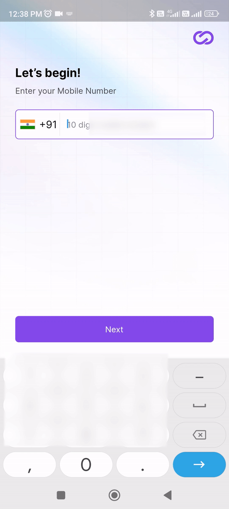
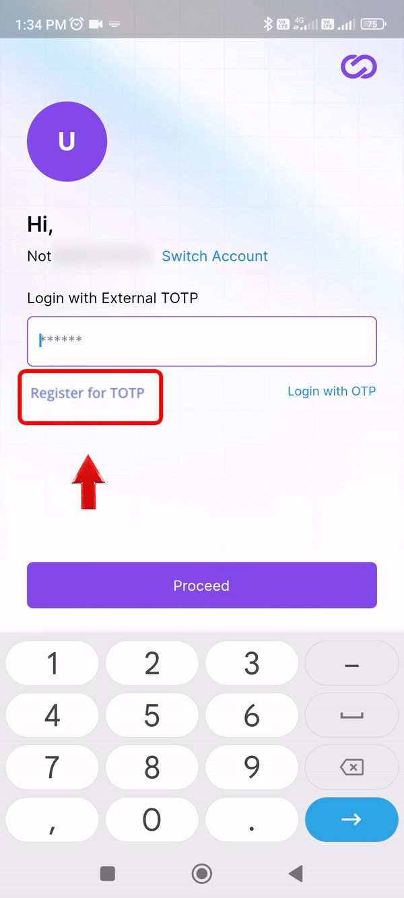
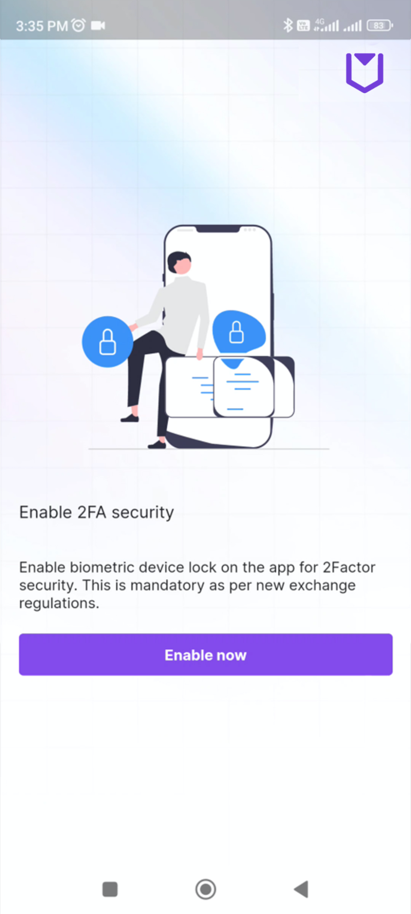
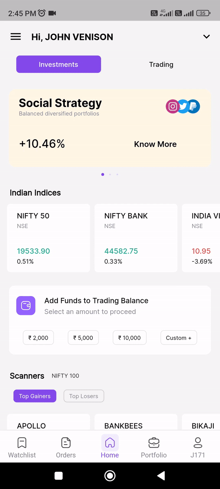
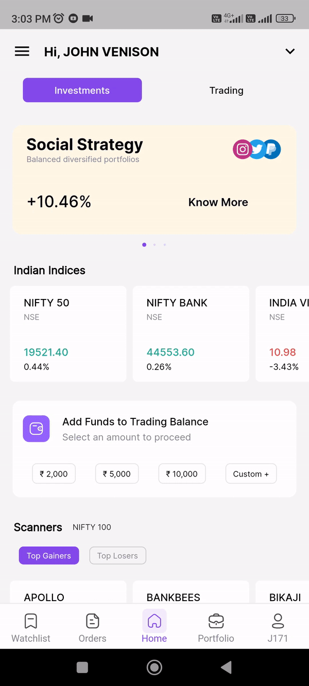
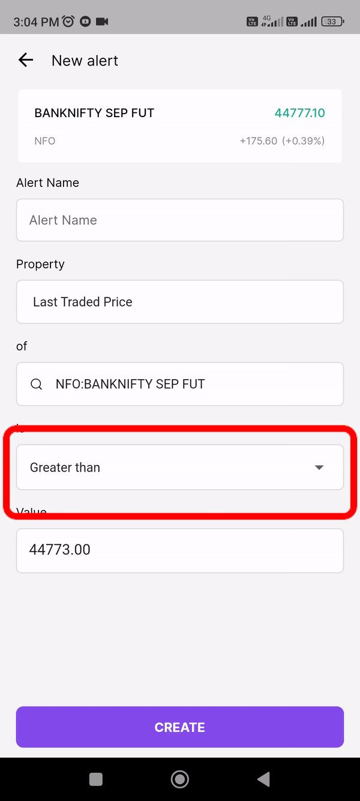
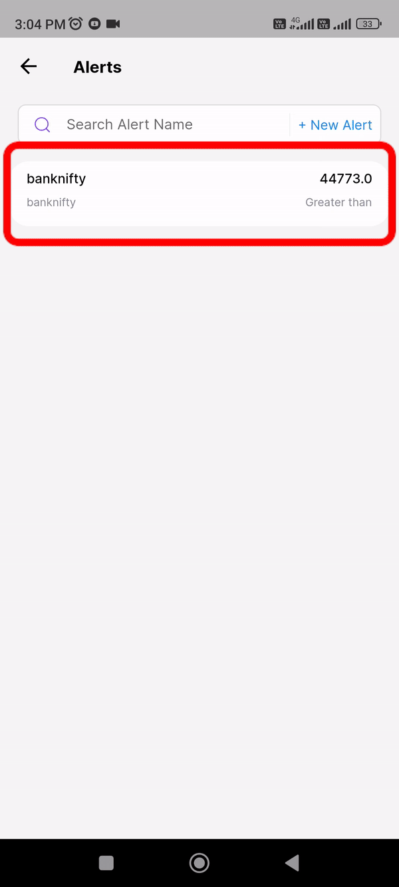

# Getting started

Gopocket is a powerful trading platform that offers a wide range of features and benefits, with a low-cost, easy-to-use trading experience. Bandwidth consumption of less than 0.5Kbps for full market watch,also a trading view platform integrated with our mob app. More than 100 indicators and 15+ chart types, for faster order placement. 

## Login

To log in to gopocket app, follow these steps

 * Enter your mobile number
 * Enter your password
 * Enter OTP number which we send to your registered mobile number or you can use totp using google authenticator
 * Press proceed to login
 * Enable 2FA security.

{: style="max-width: 280px;""}

## TOTP

__TOTP authentication process:__

* To login into Gopocket mobile app with TOTP follow these few steps
* After providing your mobile number and password, click on "Register for TOTP."
* Enter the One-Time Password (OTP) sent to your registered mobile number.
* A QR code scan page will open
* Copy the secret key
* Download the "Google Authenticator" app. Install the app if you haven't already.
* Open the Google Authenticator app and click on the "+ icon" Enter a setup key".
* Enter your client code in account name tab, then paste your secret key and click add
* Your account will be added in Google authenticator displaying your client code.
* Enter the TOTP (Time-Based One-Time Password) generated by Google Authenticator into Gopocket.
* Click "Next" in the Gopocket app.
* Enter the second TOTP to login to your account

{: style="max-width: 280px;""}

Click enable now button to enable 2 factor security which will enable biometric device lock/unlock. This is mandatory as per new exchange regulations.

{: style="max-width: 300px;""}

**Welcome to Gopocket mobile app**

**Home page**

## Investment section

__How to add funds?__

* Add funds in the trading balance section by selecting predefined value of  5000, 10000 etc., or you can custom your payment also by entering the amount 
* Select payment method to proceed to pay

### ETF Section

An ETF, or exchange traded fund, is a marketable security that tracks an index, a commodity, bonds, or a basket of assets like an index fund. In simple terms, ETFs are funds that track indexes such as CNX Nifty or BSE Sensex, etc.

### SGB Section

SGBs are government securities denominated in grams of gold. They are substitutes for holding physical gold. Investors have to pay the issue price in cash and the bonds will be redeemed in cash on maturity.

### IPO Section

An initial public offering (IPO) refers to the process of offering shares of a private corporation to the public in a new stock issuance for the first time. An IPO allows a company to raise equity capital from public investors. 

## Trading page section

### How to trade in option chain?

  In the Home page select the trading section then go to the option chain in top left. Then in the right top corner select the search icon to choose the desired option chain you want to trade to buy and sell.

{: style="max-width: 300px;""}

### How to use the alert tab?

In the Home page select the trading section then go to the Alerts in top right. Click the alert tab,click search icon third tab to type your preferred trade name ( Nifty 50, Banknifty, Nifty Bees, Nifty 100) and select it. 

{: style="max-width: 300px;""}

Strike price of your preferred  trade is automatically fetched into alerts and set the strike price to less than or equal to (or) greater than equal to value whichever you preferred for set alert.  Then top section there is alert name tab type your alert name for your reminder and then click create 

{: style="max-width: 300px;""}

### How to edit your alert?

Press an alert which you created before and then click edit to modify your alerts field. Then click save to modify the alert.

{: style="max-width: 300px;""}

